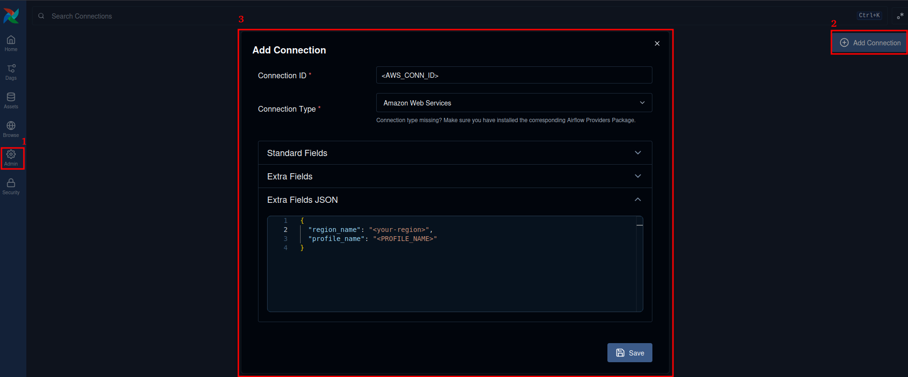
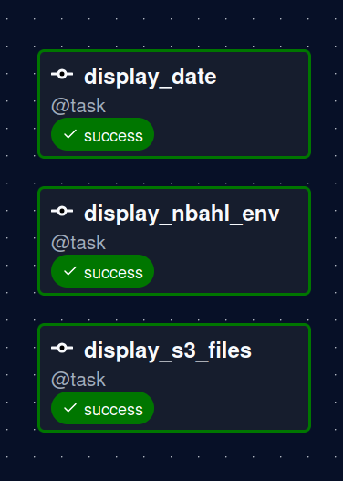

# Airflow Local Setup

## Prerequisites

Before running Airflow locally, you need to be able to connect to AWS services.
We use IAM Identity Center for this. If you do not have it or do not know how
to set it up, you can use the following pages as guidance:

- [Installing or updating to the latest version of the AWS CLI](https://docs.aws.amazon.com/cli/latest/userguide/getting-started-install.html) - make sure to install AWS CLI version 2.
- [Getting started with IAM Identity Center](https://docs.aws.amazon.com/singlesignon/latest/userguide/getting-started.html).
- [Configuring IAM Identity Center authentication with the AWS CLI](https://docs.aws.amazon.com/cli/latest/userguide/cli-configure-sso.html).
- [Tutorial: Using IAM Identity Center to run Amazon S3 commands in the AWS CLI](https://docs.aws.amazon.com/cli/latest/userguide/cli-configure-sso-tutorial.html) - useful for verifying that everything is set up correctly.
- [Using IAM Identity Center to authenticate AWS SDK and tools](https://docs.aws.amazon.com/sdkref/latest/guide/access-sso.html).

The rationale for using IAM Identity Center and the AWS account setup details can be found here:

- [0003-aws-access-method.md](../adr/0003-aws-access-method.md).
- [aws-account-setup.md](./aws-account-setup.md).

---

Next, fill in all values in `.env` using `.env.example` as a template:

```bash
cp .env.example .env
```

Then verify that you can log in via your SSO profile:

```bash
aws sso login --profile <profile-name>
```

---

## Running Locally

| Command | Description |
|---|---|
| `make up` | Create and start all containers/services |
| `docker ps` | Check that all containers are running and healthy |
| `make down` | Stop and remove containers, networks, and named volumes |

---

## Access Airflow UI and Add AWS Connection

Open the Airflow UI at **http://localhost:8080**.

You will be prompted to log in - use the credentials defined in your `.env` file:

| Field | Variable |
|---|---|
| Username | `_AIRFLOW_WWW_USER_USERNAME` |
| Password | `_AIRFLOW_WWW_USER_PASSWORD` |

After logging in, add an AWS connection before triggering any DAG:

1. Go to the **Admin** tab in the left sidebar and click **Connections**.
2. Hit the **Add Connection** button.
3. Fill in the form as shown in the screenshot below.

> **Note:** If you use SSO login, leave **AWS Access Key ID** and **AWS Secret Access Key** empty.

<p align="center">
  
  <br/>
  <em>AWS connection configuration</em>
</p>

Once the connection is saved, go to the **DAGs** tab and trigger the `smoke_test` DAG manually. If everything is configured correctly, all tasks should complete successfully.

<p align="center">
  
  <br/>
  <em>Successful smoke_test DAG run</em>
</p>

> **Tip:** If the `display_s3_files` task fails due to an expired SSO token, refresh it with:
>
> ```bash
> aws sso login --profile <PROFILE_NAME>
> ```
