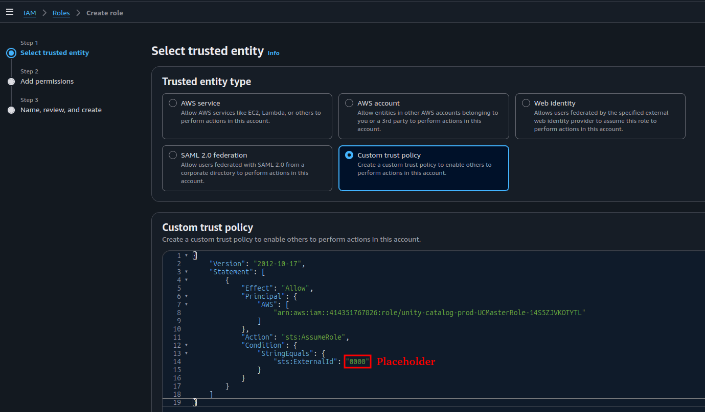
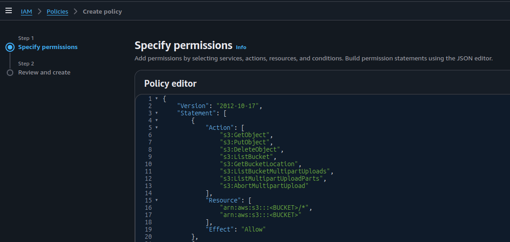
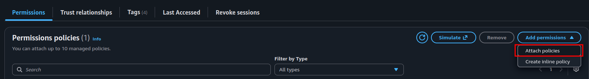
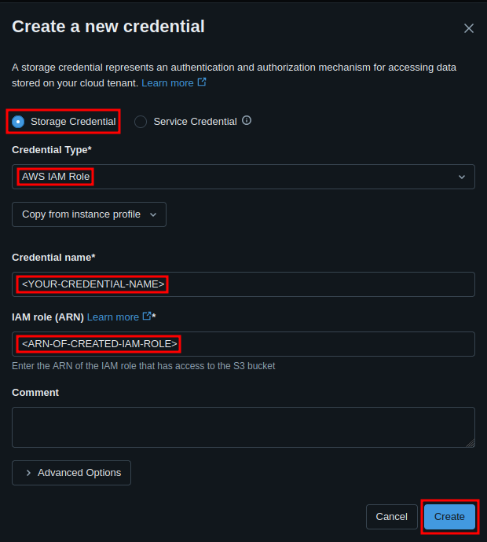
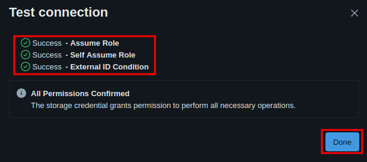
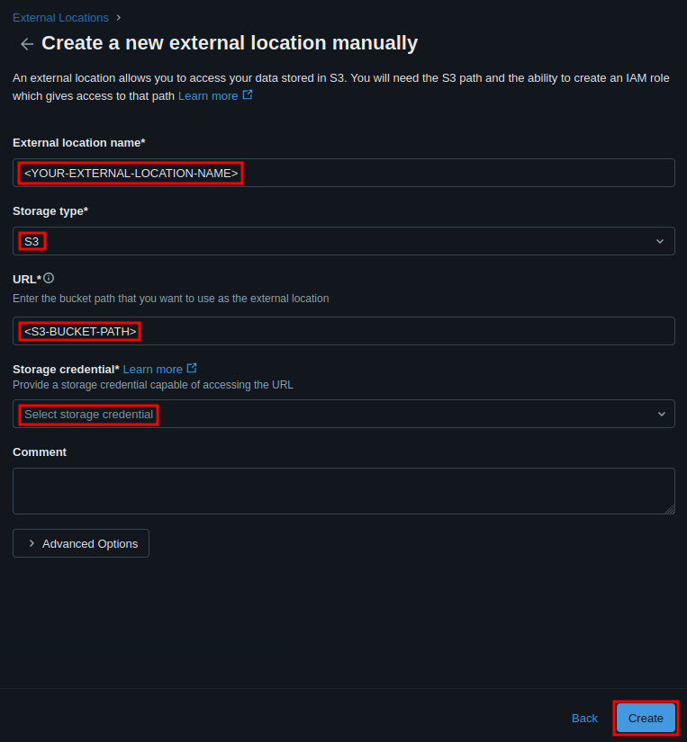

# Databricks S3 Setup

Connect Databricks Unity Catalog to an AWS S3 bucket by creating an IAM role, a storage credential, and an external location.

**High-level flow:**
`AWS IAM role` -> `Databricks storage credential` -> `update IAM trust policy` -> `validate` -> `external location`

---

## Prerequisites

| Requirement | Details |
|---|---|
| S3 bucket | Must already exist; avoid dot notation in bucket names |
| Databricks privileges | `CREATE STORAGE CREDENTIAL` and `CREATE EXTERNAL LOCATION` on the metastore |
| AWS permissions | `iam:CreateRole` and `iam:CreatePolicy` |

---

## Part 1 - Storage Credential

### Step 1: Create an IAM Role

In the AWS IAM console, click **Create role** -> **Custom Trust Policy** and paste the policy below.

> **Note:** The `ExternalId: "0000"` is a temporary placeholder. You will replace it with the real value from Databricks in Step 3.

```json
{
  "Version": "2012-10-17",
  "Statement": [
    {
      "Effect": "Allow",
      "Principal": {
        "AWS": ["arn:aws:iam::414351767826:role/unity-catalog-prod-UCMasterRole-14S5ZJVKOTYTL"]
      },
      "Action": "sts:AssumeRole",
      "Condition": {
        "StringEquals": {
          "sts:ExternalId": "0000"
        }
      }
    }
  ]
}
```

<p align="center">
  
  <br/>
  <em>Create an IAM Role</em>
</p>

---

### Step 2: Create and Attach an IAM Policy

Create a new policy with the JSON below and attach it to the role from Step 1. Replace all `<PLACEHOLDER>` values with your own.

```json
{
    "Version": "2012-10-17",
    "Statement": [
        {
            "Action": [
                "s3:GetObject",
                "s3:PutObject",
                "s3:DeleteObject",
                "s3:ListBucket",
                "s3:GetBucketLocation",
                "s3:ListBucketMultipartUploads",
                "s3:ListMultipartUploadParts",
                "s3:AbortMultipartUpload"
            ],
            "Resource": [
                "arn:aws:s3:::<YOUR-BUCKET>/*",
                "arn:aws:s3:::<YOUR-BUCKET>"
            ],
            "Effect": "Allow"
        },
        {
            "Action": ["sts:AssumeRole"],
            "Resource": [
                "arn:aws:iam::<YOUR-AWS-ACCOUNT-ID>:role/<YOUR-AWS-IAM-ROLE-NAME>"
            ],
            "Effect": "Allow"
        },
        {
            "Sid": "ManagedFileEventsSetupStatement",
            "Effect": "Allow",
            "Action": [
                "s3:GetBucketNotification",
                "s3:PutBucketNotification",
                "sns:ListSubscriptionsByTopic",
                "sns:GetTopicAttributes",
                "sns:SetTopicAttributes",
                "sns:CreateTopic",
                "sns:TagResource",
                "sns:Publish",
                "sns:Subscribe",
                "sqs:CreateQueue",
                "sqs:DeleteMessage",
                "sqs:ReceiveMessage",
                "sqs:SendMessage",
                "sqs:GetQueueUrl",
                "sqs:GetQueueAttributes",
                "sqs:SetQueueAttributes",
                "sqs:TagQueue",
                "sqs:ChangeMessageVisibility",
                "sqs:PurgeQueue"
            ],
            "Resource": [
                "arn:aws:s3:::<YOUR-BUCKET>",
                "arn:aws:sqs:*:*:csms-*",
                "arn:aws:sns:*:*:csms-*"
            ]
        },
        {
            "Sid": "ManagedFileEventsListStatement",
            "Effect": "Allow",
            "Action": ["sqs:ListQueues", "sqs:ListQueueTags", "sns:ListTopics"],
            "Resource": [
                "arn:aws:sqs:*:*:csms-*",
                "arn:aws:sns:*:*:csms-*"
            ]
        },
        {
            "Sid": "ManagedFileEventsTeardownStatement",
            "Effect": "Allow",
            "Action": ["sns:Unsubscribe", "sns:DeleteTopic", "sqs:DeleteQueue"],
            "Resource": [
                "arn:aws:sqs:*:*:csms-*",
                "arn:aws:sns:*:*:csms-*"
            ]
        }
    ]
}
```

<p align="center">
  
  <br/>
  <em>Create an IAM Policy</em>
</p>

<p align="center">
  
  <br/>
  <em>Attach IAM Policy to the Role</em>
</p>

---

### Step 3: Create a Storage Credential in Databricks

1. Go to **Catalog** -> **Connect** -> **Credentials**
2. Click **Create credential** -> **AWS IAM Role**
3. Enter a **Name** and paste the **IAM Role ARN** from Step 1
4. Click **Create** - copy the **External ID** from the confirmation dialog

> **Important:** Save the External ID before closing the dialog. You need it in Step 4.

<p align="center">
  
  <br/>
  <em>Create Storage Credential</em>
</p>

---

### Step 4: Update the IAM Role Trust Policy

Return to the IAM role and replace the trust policy. Substitute your account ID, role name, and the External ID from Step 3.

```json
{
  "Version": "2012-10-17",
  "Statement": [
    {
      "Effect": "Allow",
      "Principal": {
        "AWS": [
          "arn:aws:iam::414351767826:role/unity-catalog-prod-UCMasterRole-14S5ZJVKOTYTL",
          "arn:aws:iam::<YOUR-AWS-ACCOUNT-ID>:role/<THIS-ROLE-NAME>"
        ]
      },
      "Action": "sts:AssumeRole",
      "Condition": {
        "StringEquals": {
          "sts:ExternalId": "<STORAGE-CREDENTIAL-EXTERNAL-ID>"
        }
      }
    }
  ]
}
```

> **Note:** Adding the role itself as a principal (the second entry) is required - Databricks validates the **Self Assume Role** check during credential validation.

---

### Step 5: Validate the Storage Credential

1. In Databricks, go to **Catalog** -> **Connect** -> **Credentials**
2. Select your credential -> **Validate Configuration**
3. All checks must pass, especially **Self Assume Role**

> **Warning:** If validation fails, return to Step 4 and verify the trust policy contains both principals and the correct External ID.

<p align="center">
  
  <br/>
  <em>Validate Storage Credential</em>
</p>

---

## Part 2 - External Location

### Create an External Location

**Via Catalog Explorer:**

1. Go to **Catalog** -> **Connect** -> **External Locations**
2. Click **Create external location** -> **Manual** -> **Next**
3. Fill in **Name**, set **Storage type** to `S3`, enter `s3://<your-bucket>`, and select the credential from Part 1
4. Click **Create**

<p align="center">
  
  <br/>
  <em>Create External Location</em>
</p>

**Via SQL:**

```sql
CREATE EXTERNAL LOCATION `<location-name>` URL 's3://<bucket-path>'
WITH (STORAGE CREDENTIAL `<credential-name>`);
```
